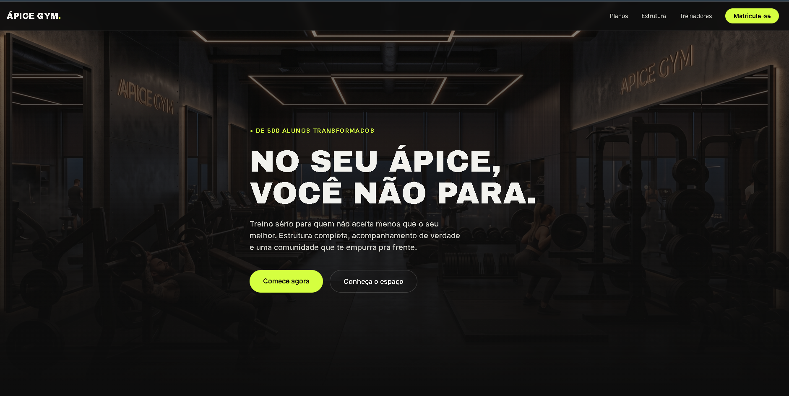

# Ápice Gym 

Landing page completa para uma academia fictícia, desenvolvida como projeto de estudo em React. 
🔗 **Site no ar:** [https://apice-gym-pi.vercel.app/]

## Funcionalidades

- Hero com carrossel automático de imagens
- Seção de benefícios com cards e imagens
- Galeria do espaço da academia (carrossel com navegação)
- Serviços oferecidos
- Planos com alternância Mensal/Anual e seleção interativa
- Depoimentos em carrossel
- Perguntas frequentes 
- Formulário de contato
- Totalmente responsivo (desktop, tablet e mobile)

## Stacks usadas:

- [React](https://react.dev/)
- [TypeScript](https://www.typescriptlang.org/)
- [Vite](https://vitejs.dev/)
- [Tailwind CSS](https://tailwindcss.com/)

## Rodando localmente:

```bash
git clone https://github.com/igornanes/apice-gym.git
cd apice-gym
npm install
npm run dev
```


## Autor:

Desenvolvido por [Igor Nanes](https://github.com/igornanes), estudante de Ciência da Computação, como projeto de aprendizado em React.